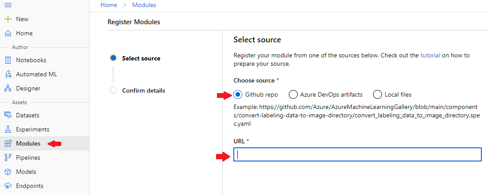

# Azure Machine Learning modules repository

This repository contains un-official Azure Machine Learning modules to use along with Designer. The modules contain a variety of functionalities to improve the current capabilities.

## Modules:
The following modules are available.

### General

- **Promote metrics to experiment:** When using the 'Evaluate Model' module, Azure ML will not report the computed metrics back to the experiment. If you are working using both designer and custom-code, this can prevent you from comparing the metrics across those runs inside of an experiment. This module promotes the metrics back to the experiment. In the case of evaluating more than one model, this module allows you to log either both of the metrics are the model with the best one. [See documentation.](docs/promote-metrics.MD)

### Data transformation

- **Dimensionality reduction**
    - **PCA extraction:** The module analyzes your data and creates a reduced feature set that captures all the information contained in the dataset, but in a smaller number of features. The module also creates a transformation that you can apply to new data, to achieve a similar reduction in dimensionality and compression of features, without requiring additional training. The computed eigenvectors are also returned as a dataset. [See documentation.](docs/extract-pca.MD)
    - **Hicherical feature aggreation:** This module is a dimensionality reduction method that groups together features that look very similar, thus decreasing the number of features. The module performs a hierarchical clustering using a bottom up approach: each observation starts in its own cluster, and clusters are successively merged together. [See documentation.](docs/feature-agglomeration.MD)

 - **Transformations**
    - **Apply Transformation (Scikit-learn API):** The module allows you to apply a given transformation to a new dataset for consistent data handling. For example, if you used PCA to transform your feature space, you would want to use the same transformation was computed for training during the scoring phase as well. You can do this easily by saving the transformation, and then using Apply Transformation to the new data. This works analogy to the `Apply Transformation` Azure ML Designer module, but works with any transformation that implements the Scikit-learn API. [See documentation.](docs/apply-transformation.MD)
    - **Apply Transformation (Tensorflow API):** The module allows you to apply a given transformation to a new dataset for consistent data handling. For example, if you used PCA to transform your feature space, you would want to use the same transformation was computed for training during the scoring phase as well. You can do this easily by saving the transformation, and then using Apply Transformation to the new data. This works analogy to the `Apply Transformation` Azure ML Designer module, but works with any transformation implemented as a compute graph in Tensorflow.

## Installation
You can install this modules in your workspace manually using the UI or by running an installation script. The installation script can also be used for automatic deployment using Azure Pipelines.

### Manual installation
You can add a new module by following this steps:
 1. In your workspace, go to the `Modules` option inside the `Assets` section in the navigation menu.
 2. Click on option `New module` and then `From Yaml file`.
 3. Copy the URL of the YAML file of the module you want to install. For instance, for the module `Promote metrics` the Yaml file is `https://github.com/santiagxf/aml-modules/blob/main/aml-promote-metrics/promote-metrics.spec.yaml`

 4. Paste the URL of the yaml file in the wizard and confirm the changes.
 5. The new module will be available across all the pipelines in the workspace.

> Important: Notice that you will need to perform this action for each module you want to install. If you have multiple Azure Machine Learning workspaces available, then you will have to perform the operation on each of them. For automatic deployment options see Script-based installation.

### Script-based installation

#### Requirements:
 - Azure CLI with Azure ML extension 2.0 installed. See [installation instruction for more information](https://docs.microsoft.com/en-us/azure/machine-learning/reference-azure-machine-learning-cli)
 - Python 3.7+
 - Git

> Work in progress
