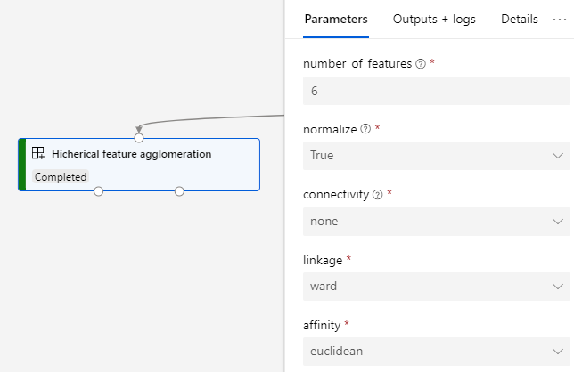
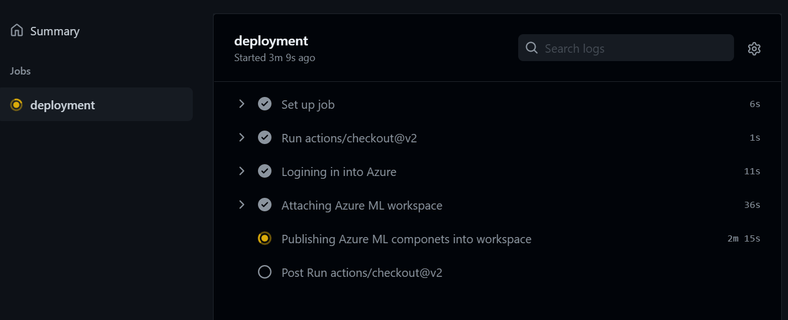

[](https://github.com/santiagxf/aml-modules/actions/workflows/ci.yml)
[](https://github.com/santiagxf/aml-modules/actions/workflows/cd.yml)

# Azure Machine Learning modules repository

> Update: Now CI/CD is supported! See [Continous deployment](#Continous-deployment)

This repository contains un-official Azure Machine Learning modules to use along with Designer. The modules contain a variety of functionalities to improve the current capabilities.



## Modules:
The following modules are available.

| Category             | Module name                                               | Description                                                                                      |
|----------------------|-----------------------------------------------------------|--------------------------------------------------------------------------------------------------|
| Experiments          | [Promote metrics to experiment](docs/promote-metrics.MD)  | When using the 'Evaluate Model' module, Azure ML will not report the computed metrics back to the experiment. If you are working using both designer and custom-code, this can prevent you from comparing the metrics across those runs inside of an experiment. This module promotes the metrics back to the experiment. In the case of evaluating more than one model, this module allows you to log either both of the metrics are the model with the best one. [See documentation.](docs/promote-metrics.MD) [Get YAML.](modules/aml_promote_metrics/promote-metrics.spec.yaml) |
| Feature Engineering  | [Add lag column](docs/lag-column.md)                      | Adds one or many lag columns into the data set. The amount of time steps to go back can be indicated. This module also allows you to average all the lag columns (average lag). This is useful, image a time series with one sample per day, to form columns like "the average value of the series on the same day of week in the past three weeks". We can do that by indicating `lag_columns=3`, `lag_by=7`, `average=True`. Multiple columns can be generated by indicated `comma-separated` column names. [See documentation.](docs/lag-column.md) [Get YAML.](modules/aml_add_lag_column/add_lag_column.spec.yaml) |
| Feature Engineering  | [Add rolling window column]()                             | Adds a rolling window column (formed with either backward or forward values). Values are aggregated based on a variety of aggregation functions depending on the type of the column. Multiple columns can be generated by indicated `comma-separated` column names. [Get YAML.](modules/aml_add_rolling_column/add_rolling_column.spec.yaml) |
| Feature Engineering  | [Aggregate column]()                                      | Groups values of columns in the dataset and aggregates the rest of them with functions depending on the type of data. All the columns will be aggregated if not indicated in the 'group by' selector. Multiple columns can be generated by indicated `comma-separated` column names. [Get YAML.](modules/aml_aggregate_columns/aggregate_columns.spec.yaml) |
| Feature Engineering  | [Split column values]()                                   | Splits the values of an string column into multiple rows or columns. It can also split them in an array-like. [Get YAML.](modules/aml_split_column/split-column.spec.yaml) |
| Feature Engineering  | [Explode column]()                                        | Runs the typical `explode` function over a column. It can explode into rows or into columns. [Get YAML.](modules/aml_explode_column/explode_column.spec.yaml) |
| Feature Engineering  | [Featurize date column]()                                 | Creates multiple feature columns based on a date column that can be use in a classification or regression problem later. Can handle either `date` columns as well as `datetime`. [Get YAML.](modules/aml_featurize_date_column/featurize_date_column.spec.yaml) |
| Dimensionality reduction | [PCA extraction](docs/extract-pca.MD)                          | The module analyzes your data and creates a reduced feature set that captures all the information contained in the dataset, but in a smaller number of features. The module also creates a transformation that you can apply to new data, to achieve a similar reduction in dimensionality and compression of features, without requiring additional training. The computed eigenvectors are also returned as a dataset. [See documentation.](docs/extract-pca.MD) [Get YAML.](modules/aml_extract_pca/extract-pca.spec.yaml) |
| Dimensionality reduction | [Trunked-SVD extration]()                                      | The module analyzes your data and creates a reduced feature set that captures all the information contained in the dataset, but in a smaller number of features. Works similar than PCA but without centring your data. [Get YAML.](modules/aml_extract_svd/extract-svd.spec.yaml) |
| Dimensionality reduction | [Hicherical feature aggreation](docs/feature-agglomeration.MD) | This module is a dimensionality reduction method that groups together features that look very similar, thus decreasing the number of features. The module performs a hierarchical clustering using a bottom up approach: each observation starts in its own cluster, and clusters are successively merged together. [See documentation.](docs/feature-agglomeration.MD) [Get YAML.](modules/aml_feature_agglomeration/feature-agglomeration.spec.yaml) |
| Transformations      | [Apply Transformation (Scikit-learn API)](docs/apply-transformation.MD) | The module allows you to apply a given transformation to a new dataset for consistent data handling. For example, if you used PCA to transform your feature space, you would want to use the same transformation was computed for training during the scoring phase as well. You can do this easily by saving the transformation, and then using Apply Transformation to the new data. This works analogy to the `Apply Transformation` Azure ML Designer module, but works with any transformation that implements the Scikit-learn API. [See documentation.](docs/apply-transformation.MD) [Get YAML.](modules/aml_apply_transformation/apply-transformation.spec.yaml) |
| Transformations      | [Apply Transformation (Tensorflow API)](docs/apply-transformation.MD)   | The module allows you to apply a given transformation to a new dataset for consistent data handling. For example, if you used PCA to transform your feature space, you would want to use the same transformation was computed for training during the scoring phase as well. You can do this easily by saving the transformation, and then using Apply Transformation to the new data. This works analogy to the `Apply Transformation` Azure ML Designer module, but works with any transformation implemented as a compute graph in Tensorflow. |
| Scoring & Evaluation | [One-way ANOVA]() | Computes the one-way ANOVA table for a linear model. [Get YAML.](modules/aml_anova_oneway/anova_oneway.spec.yaml) |
| Scoring & Evaluation | [Score MLFlow model]() | Loads a model registerd using MLFlow and runs it against a dataset. [Get YAML.](modules/aml_mlmodel_run/mlmodel_run.spec.yaml) |


## Installation
You can install this modules in your workspace manually using the UI, an installation script, or by running our automated GitHub Action pipelines.

### Manual installation
You can add a new module by following this steps:
 1. In your workspace, go to the `Modules` option inside the `Assets` section in the navigation menu.
 2. Click on option `New module` and then `From Yaml file`.
 3. Copy the URL of the YAML file of the module you want to install. For instance, for the module `Promote metrics` the Yaml file is `https://github.com/santiagxf/aml-modules/blob/main/aml-promote-metrics/promote-metrics.spec.yaml`


 4. Paste the URL of the yaml file in the wizard and confirm the changes.
 5. The new module will be available across all the pipelines in the workspace.

> Important: Notice that you will need to perform this action for each module you want to install. If you have multiple Azure Machine Learning workspaces available, then you will have to perform the operation on each of them. For automatic deployment options see Script-based installation.

### Using an installation script
In the folder [`scripts`](scripts/install.sh) you will find a sample bash script to install all the modules in your workspace.

Ensure to:
 - Clone the current repository.
 - Have Azure CLI and Azure ML CLI installed.
 - Run it using a bash console.

### Continous deployment

You can automate the deployment of the actions by using the CI/CD GitHub Actions workflow provided in this repository. The CI workflow can automatically run PyTest test over the modules code and validate modules against Azure ML API to ensure YML correctness. The CD workflow will take all the modules and install them inside the Azure ML Workspace. It will also upgrade the default version of the module to the indicated one.



#### Requirements:
- A Service Principal created in the tenant.
- The Client ID, Client Secret and Tenant ID associated with the indicated service principal.
- Grant permissions to the service principal in the target resource group/Azure Machine Learning Workspace.


#### Configuration:

Configure the `env` sections in the `CI.yml` and `CD.yml` according to your workspace

```yml
    env:
      COMPONENTS_PATH: modules
      WORKSPACE: aa-ml-aml-showroom-ws
      RESOURE_GROUP: Analytics.Aml.Experiments.Workspaces
```

> Note: This CI/CD workflow will look for any module definition inside the `COMPONENTS_PATH` and will try to install them in the workspace. If the component is already there, it will be upgraded too and the new default version upgraded.
