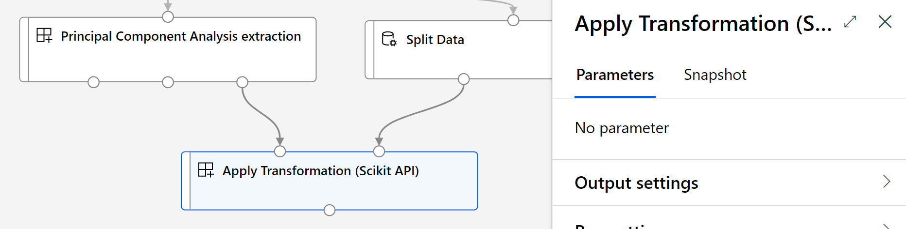

# Azure Machine Learning modules repository

This repository contains un-official Azure Machine Learning modules to use along with Designer. The modules contain a variety of functionalities to improve the current capabilities.

## Apply Transformation (Scikit-learn API)
The module allows you to apply a given transformation to a new dataset for consistent data handling. For example, if you used PCA to transform your feature space, you would want to use the same transformation was computed for training during the scoring phase as well. You can do this easily by saving the transformation, and then using Apply Transformation to the new data. This works analogy to the `Apply Transformation` Azure ML Designer module, but works with any transformation that implements the Scikit-learn API.

## Usage
You will typically connect this to a persisted transformation that implements the Scikit-Learn API or to a transformation module that implements the Scikit-Learn API.

**Inputs:**
 - **Transformation:** A Scikit-learn compatible transformation persisted in Pickle format. 
 - **Dataset:** The input data that you want to apply the transformation to.

 **Outputs:**
  - **Transformed dataset:** The input dataset after applying the transformation. 
