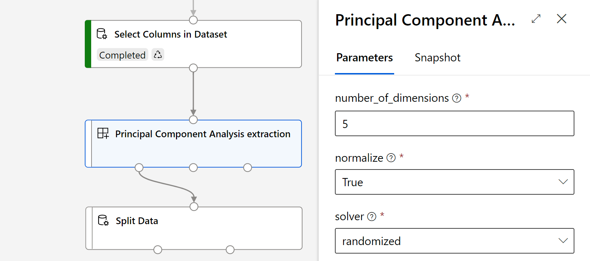
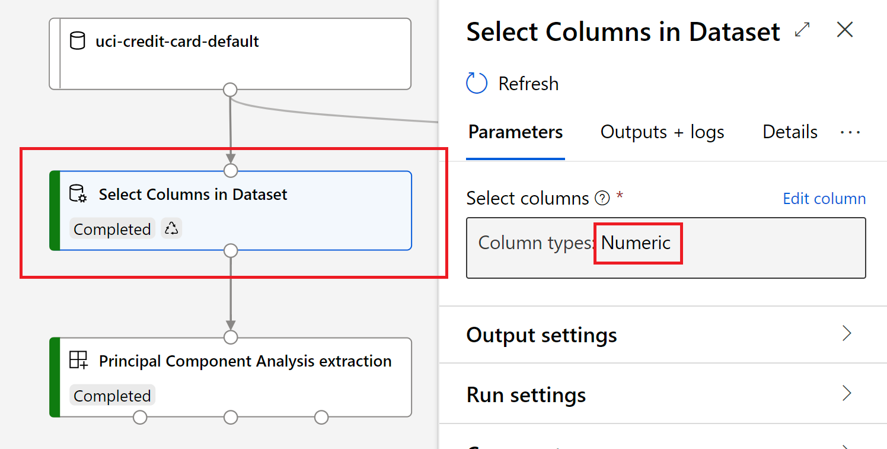
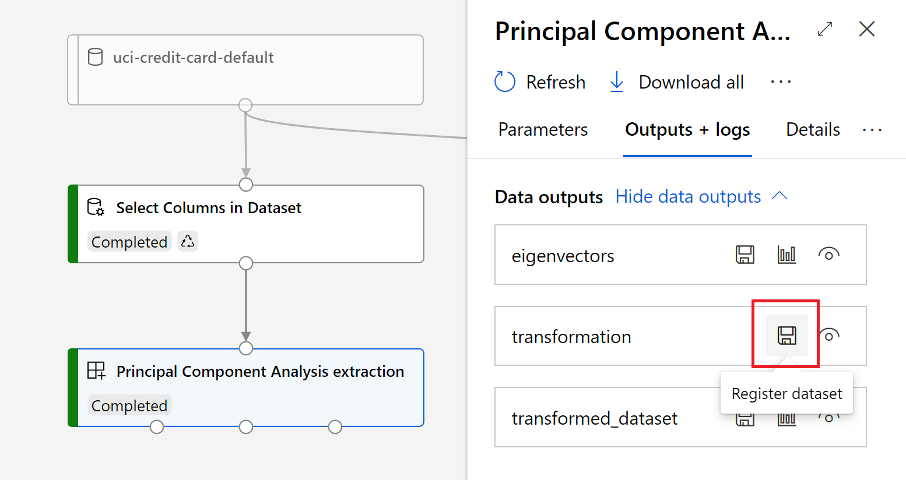

# Azure Machine Learning modules repository

This repository contains un-official Azure Machine Learning modules to use along with Designer. The modules contain a variety of functionalities to improve the current capabilities.

## Extract PCA features
The module analyzes your data and creates a reduced feature set that captures all the information contained in the dataset, but in a smaller number of features. The module also creates a transformation that you can apply to new data, to achieve a similar reduction in dimensionality and compression of features, without requiring additional training. The computed eigenvectors are also returned as a dataset.

## Usage
You will typically connect this to a dataset containing numeric values to compute a low-level representation of the data. It is a good idea to pair this module with `Select Columns in Dataset` module and filter by `Column Type` == `Numeric` to ensure to supply numeric values.

**Parameters:**
 - **Number of components:** Number of components to keep. If 0 < `Number of components` < 1 and `solver` == 'full', select the number of components such that the amount of variance that needs to be explained is greater than the percentage specified by `Number of components`. If `solver` == 'arpack', the number of components must be strictly less than the minimum of features and data samples. 
 - **Normalize:** If data has to be normalized to zero mean before computing the PCA. Most of the time you want this to be true.
 - **Solver:** The method to solve the matrix decomposition. If 'auto', the solver is selected by a default policy based on number of features and components. If 'full', it runs exact full SVD calling the standard LAPACK solver via scipy.linalg.svd and select the components by postprocessing. If 'randomized', it runs randomized SVD by the method of Halko et al.

 **Outputs:**
  - **Transformed dataset:** The input dataset after applying the PCA transformation. The new dataset will have dimensionality `[samples, components]`.
  - **Eigenvectors:** The components that resulted from the PCA execution. These are the eigenvectors that can be use to transform the dataset into the lower-dimensional space.
  - **Transformation:}** The transformation associated with this operation. Use this output to save the transformation and apply it later to another dataset. This transformation can be paired with the module `Apply Transformation (Scikit-learn API)`.

  For example:

  