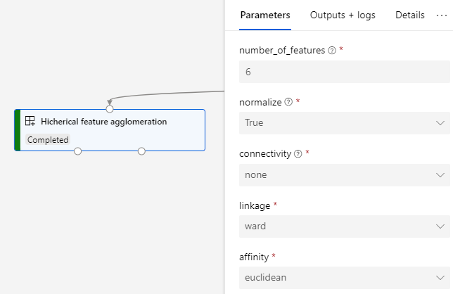

# Azure Machine Learning modules repository

This repository contains un-official Azure Machine Learning modules to use along with Designer. The modules contain a variety of functionalities to improve the current capabilities.

## Hicherical feature agglomeration
The module uses agglomerative clustering to group together features that look very similar, thus decreasing the number of features. It is a dimensionality reduction technique. The module also creates a transformation that you can apply to new data, to achieve a similar reduction in dimensionality and compression of features, without requiring additional training.

## Usage
You will typically connect this to a dataset to compute a low-level representation of the data.

**Parameters:**
 - **Number of features:** The number of features to keep. 
 - **Normalize:** If data has to be normalized to zero mean before computing the agglomeration. Most of the time you want this to be true.
 - **Connectivity:** Defines for each feature the neighboring features following a given structure of the data. If `None`, then it will consider all possible merges into the clusters. When the feature space is big, specifying a connectivity constrain can improve performance. `grid` specifies a connectivity that considers that each feature is connected with the ones before and after it. `knn` performs nearest-neighbors graph using the `minkowski` distance. 
 - **Affinity:** Metric used to compute the linkage. Can be 'euclidean', 'l1', 'l2', 'manhattan' or 'cosine'. If linkage is 'ward' (default), only 'euclidean' is accepted.
 - **Linkage:** Which linkage criterion to use. The linkage criterion determines which distance to use between sets of features. The algorithm will merge the pairs of cluster that minimize this criterion. Most of the time you will use ward or average.
    - ward minimizes the variance of the clusters being merged.
    - average uses the average of the distances of each feature of the two sets.
    - complete or maximum linkage uses the maximum distances between all features of the two sets.
    - single uses the minimum of the distances between all features of the two sets. 

 **Outputs:**
  - **Transformed dataset:** The input dataset after applying the transformation. The new dataset will have dimensionality `[samples, features]`.
  - **Transformation:** The transformation associated with this operation. Use this output to save the transformation and apply it later to another dataset. This transformation can be paired with the module `Apply Transformation (Scikit-learn API)`.

  **Additional outputs:**
  - **Dendrogram:** In the outputs folder, you will find a plot of the dendrogram representing the agglomeration of the features. You can use this graph for manual inspection of the resulting transformation. The graph is saved as a `png` image with name `dendrogram.png`.

  