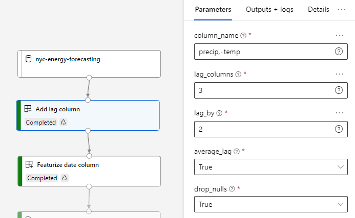
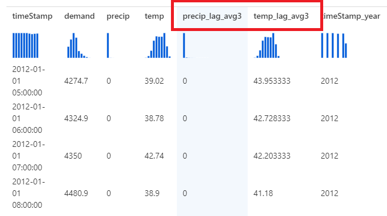

# Azure Machine Learning modules repository

This repository contains un-official Azure Machine Learning modules to use along with Designer. The modules contain a variety of functionalities to improve the current capabilities.

## Add lag column
The module adds one or many lag columns into the data set, in a times series. Each row in the dataset represents a time step which is used to generate the lagging columns by an arbitrary amount of steps. This module also allows you to average all the lag columns (also known as `average lag`). Such configuration is useful, for example image a time series with one sample per day, to form columns like "the average value of the series on the same day of week in the past three weeks". We can do that by indicating `lag columns=3`, `lag by=7`, `average=True`. Multiple columns can be generated by indicated `comma-separated` column names.

## Usage
You will typically connect this to a dataset containing time series data, and you will generate columns based on the lag configuration.

**Parameters:**
 - **Column names:** Name of the columns you want to generate lagging columns from. Multiple columns can be indicated using comma separated values. Columns can be of any type. 
 - **Lag columns:** The number of lagging columns to generate for each of the columns indicated before. For instance, a value of `3` will generate `3` columns, each of them lagging `1 x [lag by]`, `2 x [lag by]` and `3 x [lag by]` time steps.
 - **Lag by:** The amount of time steps for each of the lagging columns. For instance, a value of `7` will populate the column with values that are 7 rows above the current row.
 - **Average lag**: Indicates if lag columns should be averaged. This paramter makes sense when `lag columns` is greater than 1. When `true`, instead of outputing `lag columns` number of columns, only one new column will be output containing the average of all the values.
 - **Drop nulls**: Indicates if rows containing nulls, as a result of creating the lag column, should be removed from the dataset.

 **Outputs:**
  - **Transformed dataset:** The input dataset with the new lagging columns added.