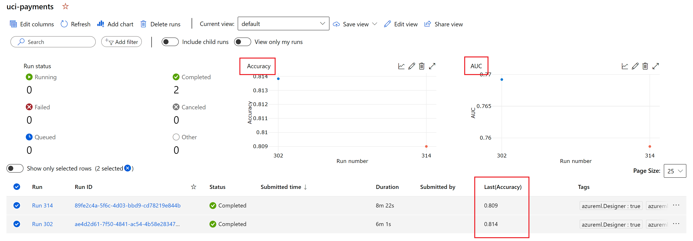
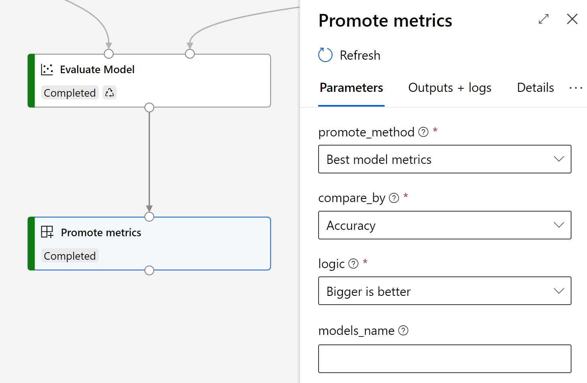

# Azure Machine Learning modules repository

This repository contains un-official Azure Machine Learning modules to use along with Designer. The modules contain a variety of functionalities to improve the current capabilities.

## Promote metrics to experiment
When using the 'Evaluate Model' module, Azure ML will not report the computed metrics back to the experiment. if you are working on different pipelines in the same experiment, this can prevent you from comparing the metrics across such runs. You can also leverage in this way the experiment's UI. This module promotes the metrics back to the experiment. In the case of evaluating more than one model, this module allows you to log either both of the metrics or the model with the best one. 

The following image shows how metrics are reported:

*Notes: On this example, all the metris were promoted for a single model but the UI of the experiment was configured to show Accuracy in the run's grid and Accuracy and AUC as graphs.*

## Usage
You will typically connect this module to the Evaluate Model module like this:

**Parameters:**
 - **Promote method:** Indicates how the promotion should work when multiple models are beeing evaluated. If `All models metrics` is selected, then each of the models will generate a metric on the experiment like `Accuracy (Model A)`, `Accuracy (Model B)`. If `Best model metrics` is selected, then only the metrics of the best model will be reported. To determine which model is the best one, you have to configure `Compare by` and `Logic` parameter. This parameter is irrelevant if you have only one model.
 - **Compare by:** Indicates which metric will be use to determine which model is the best one. As a consecuence, the module reports all the metrics of the winning model only. All out-of-the-box metrics are available for selecction. If the metric you select is not available in the model, then the first available metric is selected (check logs to see if happened). This parameter is irrelevant if you have only one model.
 - **Logic:** When `Best model metrics` is selected, you have to indicate if the metric selected in `Compared by` should be minimized or maximized. Select the logic to know when a model is better than the other based on the selected metric. This parameter is irrelevant if you have only one model.
 - **Models name:** (Optional) when using `All models metrics`, you might want to report metrics using a more insightful name rather than `Model A` or `Model B`. Use this field to specify the name of the models. Separate the models name using commas. This parameter is irrelevant if you select `Best model metrics` as promote method.

 ## Known issues
 - ROC curves, Precision-Recall curves and lift curves are not promoted to the experiment: This is a limitation due to how such data is stored as the output of the module `Evaluate Model`.